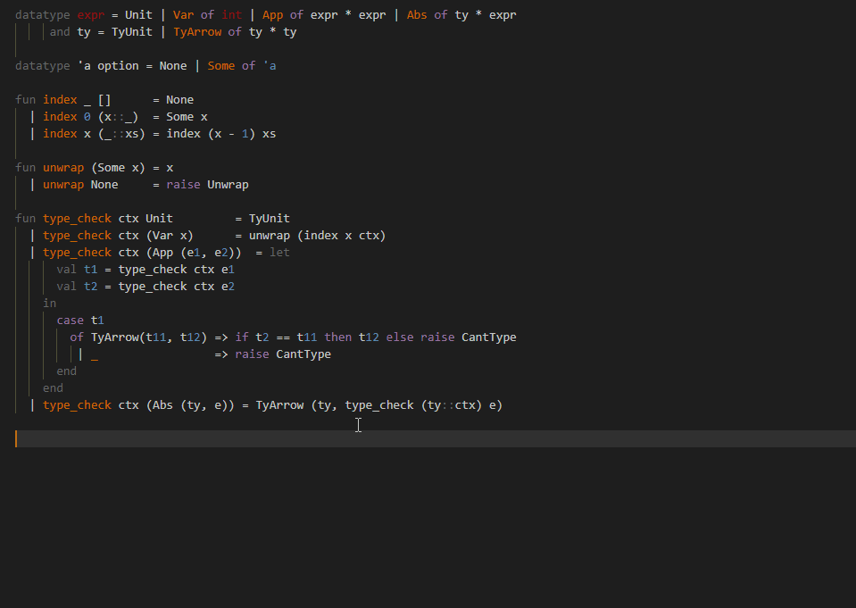

# sml-analyzer

An experimental language-server for SomewhatML that provides:

- Completions
- Type on hover
- Inline error reporting (syntatical and type unification)



```
cargo build
```

then follow the instructions below

## Running sml-analyzer

- Run `npm install` in this folder. This installs all necessary npm modules in both the client and server folder
- Open VS Code on this folder.
- Press Ctrl+Shift+B to compile the client and server.
- Switch to the Debug viewlet.
- Select `Launch Client` from the drop down.
- Run the launch config.
- If you want to debug the server as well use the launch configuration `Attach to Server`
- In the [Extension Development Host] instance of VSCode, open a document in 'plain text' language mode.
  - Type `j` or `t` to see `Javascript` and `TypeScript` completion.
  - Enter text content such as `AAA aaa BBB`. The extension will emit diagnostics for all words in all-uppercase.
